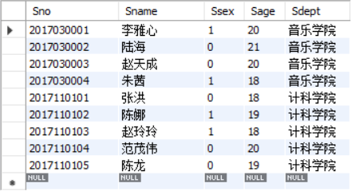
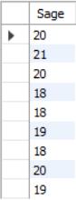
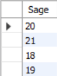
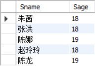
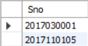

# 数据库系统
&emsp;&emsp;*数据库系统（Database System，DBS），是由数据库及其管理软件组成的系统。它是为适应数据处理的需要而发展起来的一种较为理想的数据处理的核心机构。它是一个实际可运行的存储、维护和应用系统提供数据的软件系统，是存储介质、处理对象和管理系统的集合体。*

<div align="center">
    
</div>

## 目录
  ### [📁关系数据库及标准语言SQL](#1)
    
  &emsp;&emsp;[🏷 SQL 的产生与发展](#sql-的产生与发展)
  
  &emsp;&emsp;[🏷 SQL 的特点](#sql-的特点)
  
  &emsp;&emsp;[🏷 数据库的创建](#数据库的创建)
  
  &emsp;&emsp;[🏷 基本表的建立](#基本表的建立)
  
  &emsp;&emsp;[🏷 数据类型](#数据类型)
  
  &emsp;&emsp;[🏷 基本表的修改](#基本表的修改)
  
  &emsp;&emsp;[🏷 基本表的删除](#基本表的删除)
  
  &emsp;&emsp;[🏷 表中数据的插入](#表中数据的插入)
  
  &emsp;&emsp;[🏷 表中数据的查询](#表中数据的查询)
  
  ### [📁非关系型的数据库NoSQL](#2)
  
  &emsp;&emsp;[🏷 MongoDB](#no)

<a name="1"></a>
## 关系数据库及标准语言SQL
&emsp;&emsp;🛢 **结构化查询语言（Structured Query Language， SQL）** 是关系数据库的标准语言，也是一个通用的、功能极强的关系数据库语言。其功能不仅仅是查询，而是包括数据库模式创建、数据库数据的插入与修改、数据库安全性完整性定义与控制等一系列功能。

<div align="center">
    
</div>

### SQL 的产生与发展
&emsp;&emsp;🗓 SQL 是在1974年由 Boyce 和 Chamberlin 提出的，最初叫 Sequel。

### SQL 的特点
&emsp;&emsp;💡 SQL 之所以能够为用户和业界所接受并成为国际标准，是因为它是一个综合的、功能极强同时又简洁易学的语言。SQL 集数据查询（data query）、数据操纵（data manipulation）、数据定义（data definition）和数据控制（data control）功能于一体。

&emsp;&emsp;💡 SQL 功能极强，由于设计巧妙，语言十分简洁，完成核心功能只用了9个动词，SQL 接近英语口语，因此易于学习和使用。

|SQL 功能|动词|
|:-----:|:---|
|数据查询|SELECT|
|数据定义|CREATE，DROP，ALTER|
|数据操纵|INSERT，UPDATE，DELETE|
|数据控制|GRANT，REVOKE|

### 例：学生-课程数据库
&emsp;&emsp;📃 我们以学生-课程数据库为例来体现 SQL 的数据定义、数据操纵、数据查询和数据控制语句。在学生-课程数据库中包括以下三个表：

+ [学生表](#student)： Student(Sno,Sname,Ssex,Sage,Sdept)
+ [课程表](#course)： Course(Cno,Cname,Ccredit)
+ [学生选课表](#sc)： SC(Sno,Cno,Grade)

<a name="student"></a>
***Student表：***

|学号<br>Sno|姓名<br>Sname|性别<br>Ssex|年龄<br>Sage|所在系<br>Sdept|
|:---------:|:----------:|:----------:|:----------:|:------------:|
|2017110110|范茂伟|男|20|CS|
|2017110131|李云祥|男|21|CS|
|2017120518|王敏|女|19|IS|

<a name="course"></a>
***Course表：***

|课程号<br>Cno|课程名<br>Cname|学分<br>Ccredit|
|:----------:|:-------------:|:-------------:|
|1|数据库|4|
|2|高等数学|5|
|3|数据结构|4|
|4|操作系统|2|

<a name="sc"></a>
***SC表：***

|学号<br>Sno|课程号<br>Cno|成绩<br>Grade|
|:--------:|:-----------:|:-----------:|
|2017110110|1|92|
|2017110110|2|86|
|2017110110|3|88|
|2017110131|2|90|
|2017110131|3|84|

<div align="center">
    
</div>

#### 数据库的创建
```sql
/* 创建Student库，和下面Student表同名不冲突 */
CREATE DATABASE Student;

/* 选择Student库，这样才能在这个数据库里添加表等数据 */
USE Student;
```

#### 基本表的建立
```sql
/* SQL 语言使用 CREATE TABLE 语句定义基本表（不区分大小写），其基本格式为：
    CREATE TABLE <表名> (<列名><数据类型> [列级完整性约束条件],
                         <列名><数据类型> [列级完整性约束条件],
                         ...
                         [表级完整性约束条件]
    );
*/
/* 建立一个"学生表Student" */
CREATE TABLE Student(
    Sno CHAR(10) PRIMARY KEY,    /* 列级完整性约束条件，Sno是主键 */
    Sname CHAR(20) UNIQUE,       /* Sname 取唯一值 */
    Ssex bit,                    /* 用布尔类型，01表示男女 */
    Sage SMALLINT,
    Sdept CHAR(20)
);

/* 建立一个"课程表Course" */
CREATE TABLE Course(
    Cno CHAR(4) PRIMARY KEY,      /* 列级完整性约束条件，Cno是主键 */
    Cname CHAR(40) NOT NULL,      /* 列级完整性约束条件，Cname不能取空值 */
    Ccredit SMALLINT             
);

/* 建立一个"选课表SC" */
CREATE TABLE SC(
    Sno CHAR(10),
    Cno CHAR(4),
    Grade SMALLINT,
    PRIMARY KEY(Sno,Cno),          /* 主键由两个属性构成，必须作为表级完整性进行定义 */
    FOREIGN KEY(Sno) REFERENCES Student(Sno),
                                   /* 表级完整性约束条件，Sno是外键，被参照表是Student */
    FOREIGN KEY(Cno) REFERENCES Course(Cno)
                                   /* 表级完整性约束条件，Cno是外键，被参照表是Course */
);
```

<div align="center">
    
</div>

---

[返回目录⬆](#目录)

### 数据类型
&emsp;&emsp;🎨 SQL 标准支持多种数据类型，要注意，不同的关系数据库管理系统中支持的数据类型不完全相同。

|数据类型|含义|
|:------|:---|
|CHAR(n)，CHARACTER(n)|长度为n的定长字符串|
|VARCHAR(n)，<br>CHARACTERVARYING(n)|最大长度为n的变长字符串|
|CLOB|字符串大对象|
|BLOB|二进制大对象|
|INT，INTEGER|长整数（4字节）|
|SMALLINT|短整数（2字节）|
|BIGINT|大整数（8字节）|
|NUMERIC(p,d)|定点数，由p位数字（不包括符号、小数点）组成，小数点后面有d位数字|
|DECIMAL(p,d)，DEC(p,d)|同NUMERIC|
|REAL|取决于机器精度的单精度浮点数|
|DOUBLE PRECISION|取决于机器精度的双精度浮点数|
|FLOAT(n)|可选精度的浮点数，精度至少为n位数字|
|BOOLEAN|逻辑布尔量|
|DATE|日期，包含年、月、日，格式为 YYYY-MM-DD|
|TIME|时间，包含一日的时、分、秒，格式为 HH:MM:SS|
|TIMESTAMP|时间戳类型|
|INTERVAL|时间间隔类型|

#### 基本表的修改
```sql
/* SQL 语言使用 ALTER TABLE 语句修改基本表，其一般格式为：
    ALTER TABLE <表名>
        [ADD [COLUMN] <新列名><数据类型> [完整性约束]]
        [ADD <表级完整性约束>]
        [DROP [COLUMN] <列名> [CASCADE|RESTRICT]]
        [DROP CONSTRAINT<完整性约束名> [RESTRICT|CASCADE]]
        [ALTER COLUMN <列名><数据类型>];
        
    其中<表名>是要修改的基本表，ADD子句用于增加新列、新的列级完整性约束条件和新的
    表级完整性约束条件。DROP COLUMN子句用于删除表中的列，如果指定了CASCADE短语，
    则自动删除引用了该列的其他对象，比如视图。DROP CONSTRAINT子句用于删除指定的完
    整性约束条件。ALTER COLUMN子句用于修改原有的列定义，包括修改列名和数据类型。
*/
/* 向Student表增加“入学时间”列，其数据类型为日期型 */
ALTER TABLE Student ADD S_entrance DATE;
/* 无论基本表中原来是否已有数据，新增加的列一律为空值 */

/* 将年龄的数据类型由字符型（假设原来的数据类型是字符型）改为整数 */
ALTER TABLE Student ALTER COLUMN Sage INT;

/* 增加课程名称必须取唯一值的约束条件 */
ALTER TABLE Course ADD UNIQUE(Cname);
```

#### 基本表的删除
```sql
/* SQL 语言使用 DROP TABLE 语句删除基本表，其一般格式为：
    DROP TABLE <表名> [RESTRICT|CASCADE];
    
    若选择RESTRICT，则该表的删除是有限制条件的。欲删除的基本表不能被其他表的约束所
    引用（如CHECK，FOREIGN KEY等约束），如果存在依赖该表的对象，则此表不能被删除。
    若选择CASCADE，则该表的删除没有限制条件。在删除基本表的同时，相关的依赖对象都将
    一起被删除。
    注：默认情况是RESTRICT
*/
/* 删除Student表 */
DROP TABLE Student CASCADE;
```

#### 表中数据的插入
```sql
/* 以下将用三种方式在Course表中插入数据 */
INSERT INTO Course
    VALUES('0001','数据库',5);
    
INSERT INTO Course(Cno,Cname,Ccredit)
    VALUES('0002','数据结构',4);
    
INSERT INTO Course(Cname,Cno)
    VALUES('操作系统','0003');
```
> 解决[中文编码](#no-jump)不能插入问题。在数据库建立时设置默认字符集编码： 
```sql
CREATE DATABASE Student CHARACTER SET utf8mb4 COLLATE utf8mb4_unicode_ci;
```

<div align="center">
    
</div>

---

[返回目录⬆](#目录)

### 表中数据的查询
&emsp;&emsp;📚 请先将下列数据插入到Student表中。
```sql
INSERT INTO Student
    VALUES('2017110101','张洪'  ,0,18,'计科学院');
INSERT INTO Student
    VALUES('2017110102','陈娜'  ,1,19,'计科学院');
INSERT INTO Student
    VALUES('2017110103','赵玲玲',1,18,'计科学院');
INSERT INTO Student
    VALUES('2017110104','范茂伟',0,20,'计科学院');
INSERT INTO Student
    VALUES('2017110105','陈龙'  ,0,19,'计科学院');
INSERT INTO Student
    VALUES('2017030001','李雅心',1,20,'音乐学院');
INSERT INTO Student
    VALUES('2017030002','陆海'  ,0,21,'音乐学院');
INSERT INTO Student
    VALUES('2017030003','赵天成',0,20,'音乐学院');
INSERT INTO Student
    VALUES('2017030004','朱茜'  ,1,18,'音乐学院');
```
&emsp;&emsp;📚 将下列数据插入到Course表中。
```sql
INSERT INTO Course
    VALUES('1001','离散数学',5);
INSERT INTO Course
    VALUES('1002','数据库'  ,4);
INSERT INTO Course
    VALUES('1003','高等数学',2);
```
> 因为外键原因，必须先插入Course表数据才能插入SC表数据。

&emsp;&emsp;📚 将下列数据插入到SC表中。
```sql
INSERT INTO SC
    VALUES('2017110104','1001',92);
INSERT INTO SC
    VALUES('2017110104','1002',86);
INSERT INTO SC
    VALUES('2017110104','1003',91);
INSERT INTO SC
    VALUES('2017110105','1001',89);
INSERT INTO SC
    VALUES('2017110105','1002',97);
INSERT INTO SC
    VALUES('2017110105','1003',58);
INSERT INTO SC
    VALUES('2017030001','1003',59);
INSERT INTO SC
    VALUES('2017030002','1003',68);
```
---

- **[\*](#no-jump) 表示查看表中所有数据。**

    ```sql
    SELECT * FROM Student;
    ```
    <div align="left">
        
    </div>

---

- **查看表中 [Sno](#no-jump)，[Sname](#no-jump) 两列数据。**

    ```sql
    SELECT Sno,Sname FROM Student;
    ```
    <div align="left">
        
    </div>

---

- **查询经过计算的值：查看表中 [Sname](#no-jump)，[2019-Sage](#no-jump) 两列数据。**

    ```sql
    SELECT Sname,2019-Sage FROM Student;
    ```
    <div align="left">
        
    </div>
    
---
    
- **查询经过计算的值：查看表中 [Sname](#no-jump)，['Year of Birth:'](#no-jump),[2019-Sage](#no-jump),[LOWER(Sdept)](#no-jump) 数据（其中LOWER()函数是把列中大写字母转化为小写）。**
  
    ```sql
    SELECT Sname,'Year of Birth:',2019-Sage,LOWER(Sdept) FROM Student;
    ```
    <div align="left">
        
    </div>
    
---
    
- **用户通过指定别名来改变查询结果的列标题。**
  
    ```sql
    SELECT Sname NAME,'Year of Birth:' BIRTH,
        2019-Sage BIRTHDAY,LOWER(Sdept) DEPARTMENT 
        FROM Student;
    ```
    <div align="left">
        
    </div>

---

- **消除取值重复的行。**

    ```sql
    SELECT DISTINCT Sage FROM Student;
    ```
    <div align="left">
        
    </div>
    <div align="left">
        
    </div>

---

- **通过where来查询满足条件的元组：查询"计科学院"全体学生的名单。**

    ```sql
    SELECT Sno,Sname FROM Student 
	    WHERE Sdept='计科学院';
    ```
    <div align="left">
        
    </div>

---

- **通过where来查询满足条件的元组：查询年龄在20岁以下的学生姓名及其年龄。**

    ```sql
    SELECT Sname,Sage FROM Student 
	    WHERE Sage<20;
    ```
    <div align="left">
        
    </div>
    
---

- **通过where来查询满足条件的元组：考试成绩大于等于90。**

	```sql
	SELECT DISTINCT Sno FROM SC
		WHERE Grade<60;
	```
	<div align="left">
        
    </div>
	
---
	
- **通过where来查询满足条件的元组：查询年龄在20~23岁（包括20岁和23岁）的学生信息。**

	```sql
	SELECT * FROM Student
		WHERE Sage BETWEEN 20 AND 23;
	```
	<div align="left">
        
    </div>

---
	
- **通过where来查询满足条件的元组：查询年龄不在20~23岁（包括20岁和23岁）的学生信息。**

	```sql
	SELECT * FROM Student
		WHERE Sage NOT BETWEEN 20 AND 23;
	```
	<div align="left">
        
    </div>


---

[返回目录⬆](#目录)


